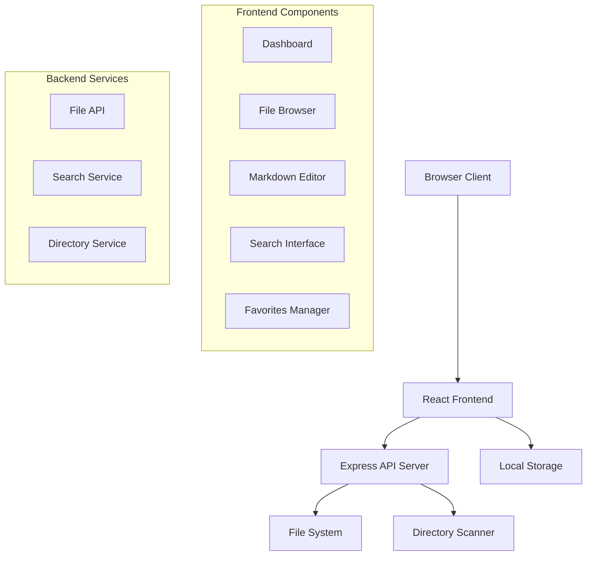

# Design Document

## Overview

マークダウンダッシュボードは、日付ベースのディレクトリ構造で管理されているマークダウンファイルを効率的に閲覧・編集・管理するためのWebアプリケーションです。フロントエンドとバックエンドを分離したアーキテクチャを採用し、RESTful APIを通じてファイルシステムとやり取りします。

## Architecture

### System Architecture



### Technology Stack

- **Frontend**: React 18 + TypeScript + Tailwind CSS
- **Backend**: Node.js + Express + TypeScript
- **Markdown Processing**: marked + highlight.js
- **Editor**: CodeMirror 6
- **Build Tool**: Vite
- **State Management**: React Context API + localStorage

## Components and Interfaces

### Frontend Components

#### 1. App Component
- **Purpose**: Root component managing global state and routing
- **State**: Current view mode, selected directory, favorites list
- **Props**: None (root component)

#### 2. Dashboard Component
- **Purpose**: Main landing page showing directory overview
- **State**: Directory list, loading state, sort order
- **Props**: `directories: DirectoryInfo[]`, `onDirectorySelect: (dir: string) => void`

#### 3. FileExplorer Component
- **Purpose**: File browser with list/grid view options
- **State**: Current directory, file list, view mode
- **Props**: `currentPath: string`, `files: FileInfo[]`, `onFileSelect: (file: FileInfo) => void`

#### 4. SearchInterface Component
- **Purpose**: Tag-based search with filters
- **State**: Search query, search results, filter options
- **Props**: `onSearch: (query: SearchQuery) => void`, `results: SearchResult[]`

#### 5. MarkdownEditor Component
- **Purpose**: In-browser markdown editor with live preview
- **State**: Editor content, preview mode, save status
- **Props**: `file: FileInfo`, `onSave: (content: string) => void`, `onCancel: () => void`

#### 6. FavoritesManager Component
- **Purpose**: Manage and display favorite files
- **State**: Favorites list, filter options
- **Props**: `favorites: FileInfo[]`, `onToggleFavorite: (file: FileInfo) => void`

### Backend API Endpoints

#### Directory Operations
```typescript
GET /api/directories
// Returns list of all date-based directories

GET /api/directories/:path/files
// Returns files in specific directory

POST /api/directories/scan
// Rescans directory structure
```

#### File Operations
```typescript
GET /api/files/:path
// Returns file content and metadata

PUT /api/files/:path
// Updates file content

DELETE /api/files/:path
// Deletes file

POST /api/files/:path/copy-path
// Returns full file path for clipboard
```

#### Search Operations
```typescript
POST /api/search
// Performs tag-based search across all files
// Body: { tags: string[], operator: 'AND' | 'OR' }

GET /api/search/tags
// Returns all available tags
```

## Data Models

### Core Data Types

```typescript
interface DirectoryInfo {
  name: string;
  path: string;
  createdAt: Date;
  fileCount: number;
  lastModified: Date;
}

interface FileInfo {
  name: string;
  path: string;
  fullPath: string;
  size: number;
  createdAt: Date;
  modifiedAt: Date;
  tags: string[];
  preview: string; // First 200 characters
  isFavorite: boolean;
}

interface SearchQuery {
  tags: string[];
  operator: 'AND' | 'OR';
  dateRange?: {
    start: Date;
    end: Date;
  };
}

interface SearchResult {
  file: FileInfo;
  matchedTags: string[];
  relevanceScore: number;
}
```

### State Management

```typescript
interface AppState {
  currentView: 'dashboard' | 'explorer' | 'search' | 'favorites' | 'editor';
  currentDirectory: string | null;
  selectedFile: FileInfo | null;
  favorites: string[]; // File paths
  searchResults: SearchResult[];
  directories: DirectoryInfo[];
}
```

## Error Handling

### Frontend Error Handling
- **Network Errors**: Display toast notifications with retry options
- **File Not Found**: Show user-friendly error messages with navigation options
- **Permission Errors**: Clear error messages with suggested solutions
- **Validation Errors**: Inline form validation with helpful hints

### Backend Error Handling
- **File System Errors**: Structured error responses with error codes
- **Path Traversal Protection**: Validate all file paths to prevent security issues
- **Large File Handling**: Stream large files and implement size limits
- **Concurrent Access**: Handle file locking and concurrent edit conflicts

### Error Response Format
```typescript
interface ErrorResponse {
  error: {
    code: string;
    message: string;
    details?: any;
  };
  timestamp: string;
  path: string;
}
```

## Testing Strategy

### Unit Testing
- **Frontend**: Jest + React Testing Library for component testing
- **Backend**: Jest + Supertest for API endpoint testing
- **Utilities**: Unit tests for file parsing, search algorithms, and data transformations

### Integration Testing
- **API Integration**: Test complete request/response cycles
- **File System Integration**: Test actual file operations with temporary directories
- **Search Integration**: Test search functionality with sample data sets

### End-to-End Testing
- **User Workflows**: Test complete user journeys from dashboard to file editing
- **Cross-browser Testing**: Ensure compatibility across major browsers
- **Performance Testing**: Test with large directory structures and files

### Test Data Strategy
- **Mock Data**: Generate realistic directory structures for testing
- **Sample Files**: Create markdown files with various tag patterns
- **Edge Cases**: Test with special characters, large files, and empty directories